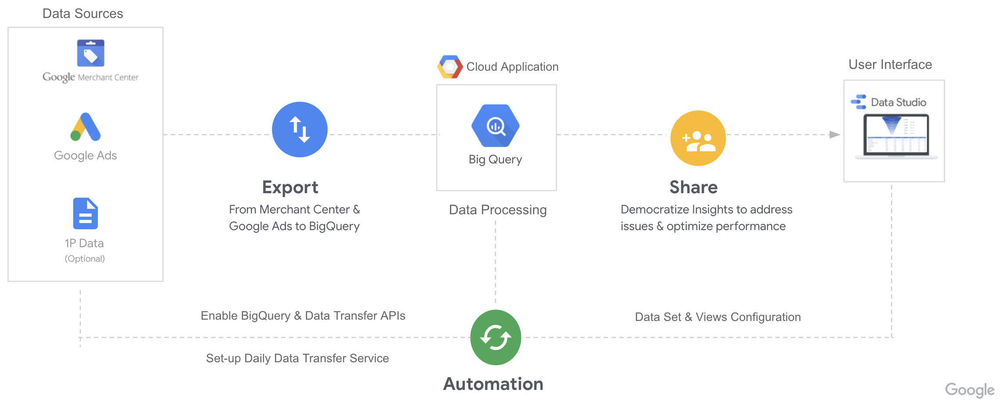

# MarkUp

---
   > **We don't recommend installing this tool if you are running only `PerfMax` campaigns. We are working on a solution to handle `PerfMax` campaigns within the scope of this solution, so stay tuned for next update!**
---

> Disclaimer: This is not an officially supported Google product.


### Please re-install MarkUp if you have installed it before <b>Oct 2021</b>. This is to support the breaking schema changes in BigQuery Data Transfer Service.
<br />

MarkUp is a tool to enable retailers grow their business using
[Google Merchant Center](https://www.google.com/retail/solutions/merchant-center/)
by taking actionable data-driven decisions to optimize shopping feed health and
ads performance.

## Contents

*   [1. Overview](#1-overview)
    *   [1.1. Value Proposition](#1-1-value-proposition)
    *   [1.2. Solution Architecture](#solution-architecture)
    *   [1.3. Solution Options](#solution-options)
*   [2. Installation](#2-installation)
    *   [2.1. Environment Setup](#environment-setup)
    *   [2.2. Cloud Environment Setup](#cloud-environment-setup)
    *   [2.3. Configure Data Sources](#configure-data-sources)
    *   [2.4. Create Data-Studio Dashboard](#data-studio-dashboard)

## 1. Overview

MarkUp solution is built for Shopping Ads customers to take actionable
data-driven decisions to improve their feed health and shopping ads performance.

### 1.1. Value Proposition

*   Users can find opportunities and issues at each stage of the Shopping Funnel
    both overall and detailed data cuts.

*   Richer insights with data joins to provide overall and product level
    performance information pivoted towards custom attributes (product type,
    brand, etc) for deeper insights.

*   Near real-time dashboard to share data and insights across different teams
    and areas of the business seamlessly to address issues & optimize
    performance.

### 1.2 Solution Architecture

The solution will export data from GMC and Google Ads to your Google Cloud
Project on a daily basis and provide insights via Data Studio dashboard.



### 1.3 Solution Options

At this time, there are two onboarding options available:

#### Markup

This is the base solution that exclusively uses the products and product issues
tables available via the Merchant Center Transfer. This will allow you to set up the
[Markup Dashboard Template](https://datastudio.google.com/reporting/806b9d3e-073a-43c2-bba0-53a0eb65302f/page/QK7kB/preview).

#### Markup + Market Insights

By enabling Market Insights during the installation process, this will
additionally configure the Market Insights tables available via the Merchant Center Transfer, Price Benchmarks & Best Sellers, as well as three additional BigQuery views:

* `market_insights_snapshot` - a snapshot view that joins the latest product feed data with available price benchmarks, best seller status, and Google Ads performance over the last 30 days.
* `market_insights_historical` - a date partitioned view that joins the latest product feed data with historical price, price benchmarks, and Google Ads performance over the entire transfer data set.
* `market_insights_best_sellers` - a view that joins the latest Best Sellers Top Products table with inventory status to show a ranked list of Top Products broken out by category.
    * Please note: this view is set to only show data for the `en-US` locale. For other locales, you will need to adjust the view's filtering after installation.

With these additional views, you will be able to set up the [Merchant Market Insights Dashboard Template](https://datastudio.google.com/reporting/37411ae9-b5f3-4062-89ea-ea521c885c30/page/QK7kB/preview) in addition to the above Markup Dashboard template.


## 2. Installation

### 2.1. Google Cloud Platform(GCP) setup

#### 2.1.1 Create a GCP project with billing account

You may skip this step if you already have a GCP account with billing enabled.

*   How to [Create a GCP account](https://cloud.google.com/?authuser=1) (if you
    don't have one already!)

*   How to
    [Create and Manage Projects](https://cloud.google.com/resource-manager/docs/creating-managing-projects)

*   How to
    [Create, Modify, or Close Your Billing Account](https://cloud.google.com/billing/docs/how-to/manage-billing-account)

#### 2.1.2 Check the permissions

Make sure the user running the installation has following permissions.

*   [Standard Access For GMC](https://support.google.com/merchants/answer/1637190?hl=en)

*   [Standard Access For Google Ads](https://support.google.com/google-ads/answer/7476552?hl=en)

*   [Editor(or Owner) Role in Google Cloud Project](https://cloud.google.com/iam/docs/understanding-roles)

### 2.2. Cloud environment setup

#### 2.2.1 Setup local environment.
[Download and authenticate gcloud.](https://cloud.google.com/sdk/#Quick_Start)

Alternatively, if the GMC account has less than 50 Million products, you could use [Cloud Shell](https://ssh.cloud.google.com/cloudshell?shellonly=true), which comes with gcloud already installed. The cloud shell disconnects after 1 hour and hence we recommend using local environment for large accounts since they could take more than 1 hour to finish the installation.

#### 2.2.2 Check out source codes

Open the [cloud shell](https://ssh.cloud.google.com/cloudshell?shellonly=true) or your terminal(if running locally)
and clone the repository.

```
  git clone https://github.com/google/shopping-markup
```

#### 2.2.3 Run install script

Please provide following inputs when running the `setup.sh` script:

*   [GCP Project Id](https://cloud.google.com/resource-manager/docs/creating-managing-projects)

*   [Google Merchant Center Id](https://support.google.com/merchants/answer/188924?hl=en)

*   [Google Ads External Customer Id](https://support.google.com/google-ads/answer/1704344?hl=en)

*   Market Insights - whether to deploy Market Insights solution. Allowed Values - True or False

```
cd shopping-markup;
sh setup.sh --project_id=<project_id> --merchant_id=<merchant_id> --ads_customer_id=<ads_customer_id> --market_insights=False
```

When installing, the script will check whether the current user has the proper
authorization to continue. It may ask you to open cloud authorization URL in the
browser. Please follow the instructions as mentioned in the command line.

#### Note - If the script fails when you run it for the first time, it might be due to delay in preparing Merchant account data. Please wait up to 1-3 days before re-running the script.

During the installation process, the script will do following:

*   Enable Google Cloud Components and Google APIs

    *   [BigQuery](https://console.cloud.google.com/bigquery)

    *   [BigQuery Data Transfer](https://console.cloud.google.com/bigquery/transfers)

*   Create Google Merchant Center and Google Ads data transfers.

*   Create recurring data transfer jobs so that the latest data is imported in
    near real time.

*   Create following MarkUp specific SQL tables.
    *   product_detailed_materialized - Latest snapshot view of products combined with performance metrics. Each offer is split into rows for each targeted country, rows are keyed by unique_product_id and target_country.
    *   product_historical_materialized - Historic snapshot of performance metrics at a product category level.

#### 2.2.4 [Optional] Update location and locales if different than US

* If your data shouldn't be materialized in US, change the BigQuery dataset location in config.yaml

* [Market Insights only] Adjust the locales in best_sellers_workflow.sql, by default set to "en-US"

* You could make the changes before running the install script or after
    * If you're making the changes afterwards, re-run the install script
    * Check the scheduled queries in BigQuery and disable any older version of the Main Workflow

## 2.3. Configure Data Sources

You will need to create or copy required Data Source(s) in Data Studio:

### For Markup:

*   Create `product_detailed_materialized` Data Source (linked to `markup.product_detailed_materialized`)
*   Create `product_historical_materialized` Data Source (linked to `markup.product_historical_materialized`)

To create a data source:

*   Click on the
    [link](https://datastudio.google.com/c/u/0/datasources/create?connectorId=2)

*   Make sure you are using BigQuery connector. If not choose "`BigQuery`" from
    the list of available connectors.

*   Search your GCP Project Id under My Projects.

*   Under Dataset, click on "`markup`".

*   Under Table, choose the required table view.

*   Click `Connect` on the top right corner and wait for the data-source to be
    created

### For Merchant Market Insights:

*   Copy [Market Insights Snapshot (TEMPLATE)](https://datastudio.google.com/datasources/9dbdb290-0ea6-4d81-90df-5e4f9ec6f504) and connect it to `markup.market_insights_snapshot_view`
*   Copy [Market Insights Historical (TEMPLATE)](https://datastudio.google.com/datasources/0397b27f-96b8-44cd-afca-645f64882a26) and connect it to `markup.market_insights_historical_view`
*   Copy  [Market Insights Best Sellers (TEMPLATE)](https://datastudio.google.com/datasources/b2f5bafe-01e2-4e30-bfb3-022a6c2f3ad6) and connect it to `markup.market_insights_best_sellers_materialized`

To copy a data source:

*  Click on the data source template link above.

*  Click on the    icon in the top right corner next to "Create Report".

*  Click "Copy Data Source" on the "Copy Data Source" pop-up.

*  Select your Project, Dataset, and Table to be connected, then press "Reconnect" in the top right corner.

*  Click "Apply" on the "Apply Connection Changes" pop-up

*  Repeat this process for all three data source templates above.

## 2.4. Create Data-Studio Dashboard(s)

### For Markup:

*   Click on the following link to the Data Studio template:
    [link](https://datastudio.google.com/reporting/22c41768-140b-4572-9bf7-4e7e1891a8dd/preview)

*   Click "`Use Template`"

*   Choose the new "`product_detailed_materialized`" and "`product_historical_materialized`" data-sources created in the previous step

*   Click "`Copy Report`"

### For Merchant Market Insights:

*   Click on the following link to the Data Studio template:
    [link](https://datastudio.google.com/reporting/806b9d3e-073a-43c2-bba0-53a0eb65302f/page/QK7kB/preview)

*   Click "`Use Template`"

*   Choose the three data-sources copied in the previous step

*   Click "`Copy Report`"

#### Note - The performance metrics in the dashboard might take 12-24 hours to appear.
